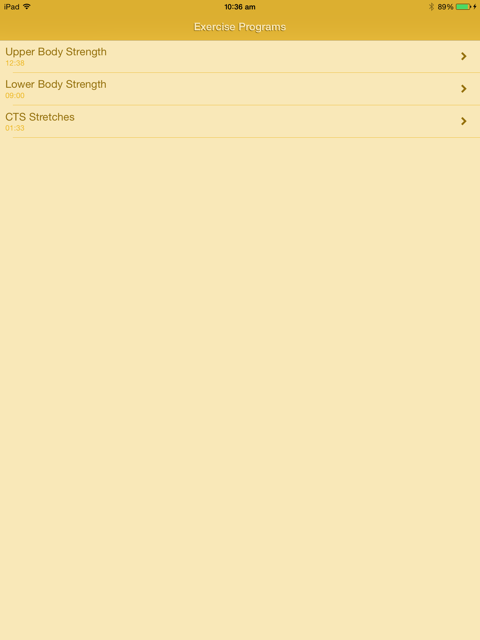
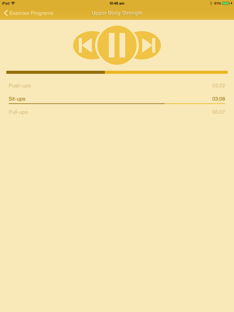

# What is it?

Workout Wotch is a mobile application (currently iOS only, but the vast majority of the code is platform-agnostic) that allows users to have their exercise programs dictated to them. It alleviates them of the need to count sets and reps, and can provide them with timing information for exercises that require a certain tempo.

Workout Wotch provides two screens. The first allows users to select an exercise program:



Once an exercise program has been selected, a second screen is displayed, which allows the user to control the playback of the exercise program:



No ability to edit exercise programs is provided within the app. Instead, changes can be made outside the app by editing a text file in iCloud. Once saved, the app will automatically refresh with the changes made. See below for more details.


# How do I use it?

First, you will need to clone and build the code. Once built, you have a choice to make: whether to run with, or without, iCloud integration.

**IMPORTANT**: regardless of whether you run with iCloud or not, you will want to run on an actual device rather than the simulator because speech synthesis is not currently supported in the simulator.

## Running without iCloud Integration

Running without iCloud integration saves you the hassle of setting up provisioning and entitlements, but does not give you the ability to dynamically modify your exercise documents. Instead, the exercise documents available in the application will come from a "hard-coded" file.

To run without iCloud integration, enable the `CannedExerciseDocumentService` by opening the *AppDelegate.Registrations.cs* file in the *WorkoutWotch.UI.iOS* project and uncommenting the indicated line:

```C#
// uncomment this if you want return a "canned" exercise document that can only be changed in code
// this is useful if you don't want to have to set up iCloud integration
container.Register<IExerciseDocumentService, CannedExerciseDocumentService>();
```

If you want to make changes to the exercise document, you'll need to modify the *DefaultExerciseDocument.mkd* file in the *WorkoutWotch.Services.iOS* project. See [writing exercise programs](Doc/writing-exercise-programs.md) for details on the syntax of the document.

## Running with iCloud Integration

If you decide you want the "full Workout Wotch experience", you'll need to follow these steps to appease the Apple gods. If you prefer, you can [follow the instructions in my video](http://www.youtube.com/watch?v=I_jherfsRKk&t=22m30s) instead.

1. Log onto the [apple developer portal](https://developer.apple.com/account/) and click on **Certificates** (or any of the other links down the left hand side).
2. Click on **iCloud Containers** and create a new container called *WorkoutWotch*
3. Click on **App IDs** and create a new App ID called *WorkoutWotch*. Be sure to enable iCloud support (no need for compatibility with Xcode 5) and click **Edit** to associate the App ID with the *WorkoutWotch* iCloud container created above
4. Under **Provisioning Profiles**, click **Development** and create a new profile called *WorkoutWotch Development*. Associate the profile with the *WorkoutWotch* App ID, with your development certificate, and with your preferred devices. Optionally, you can also create an adhoc distribution profile if you want to deploy the adhoc build to your device
5. Start Xcode, open **Preferences**/**Accounts** and add (or refresh) your Apple ID. Click **View Details...** and ensure the provisioning profiles you created above are listed within
6. In Xamarin Studio, open the *Entitlements.plist* file in the *WorkoutWotch.UI.iOS* project. Ensure **Enable iCloud** is checked and add the ID of your iCloud container to the **Containers** list
7. Open the settings for the *WorkoutWotch.UI.iOS* project. Under **iOS Application**, make sure you have the correct **Bundle Identifier**. Under **iOS Bundle Signing**, you should see the new provisioning profile you added in the **Provisioning Profile** drop-down list. You can leave the selection as **Automatic** - just as long as the profile is present in the list 

Once you've successfully done all that, you should now be able to run the app on your chosen device. The first time it runs it will notice you have no exercise programs document, so it'll create one with a couple of sample exercise programs in there for you.

To edit the exercise programs, open **Finder** on your Mac and search for a file named *Workout Wotch Exercise Programs.mkd* under your home directory. If you can't find it, it may be because iCloud has not yet synchronised.

See [writing exercise programs](Doc/writing-exercise-programs.md) for details on the syntax of the document.


# Where are the Videos?

The vast majority of the application was built as part of a video series I produced called *Building an iOS app with C#*. Below is a full list of the videos, grouped by their module. If you prefer, you can also use the [YouTube playlist](https://www.youtube.com/playlist?list=PLwqdWBgwaokVPpdPOOJ-GTGiHcqoG5alU).

|Module|Video|Link|
|:-----|:----|:--:|
|1: Introduction|Introduction|http://youtu.be/rpiVOiKdqog|
|2: Architecture|Architecture|http://youtu.be/kSADWnL1HxU|
|3: Solution/Project Setup|Solution/Project Setup|http://youtu.be/GQT6L2WpfEc|
|4: Services|Overview|http://youtu.be/OvbpqFHJRXc|
||Logger Service|http://youtu.be/0Kgp4GigOPE|
||Scheduler Service|http://youtu.be/5l5xXzYWsSI|
||State Service|http://youtu.be/6bEvIoE_rm8|
||Delay Service|http://youtu.be/Ex7ouQIgDWM|
||Exercise Document Service|http://youtu.be/AZ8uzF6at74|
||Audio Service|http://youtu.be/wT06GvzoGFs|
||Speech Service|http://youtu.be/WvW6ZbjWuOk|
||System Notifications Service|http://youtu.be/bvhujyDH0VE|
|5: Models|Overview|http://youtu.be/gGPHYl1bFBY|
||Action|http://youtu.be/kypi98ur3ZE|
||Event|http://youtu.be/6Igd9v6Ae7c|
||Event Matcher|http://youtu.be/4wSZkocu40o|
||Execution Context|http://youtu.be/oIEIcC_t-WA|
||Exercise|http://youtu.be/T_dwGiBXuzU|
||Exercise Program|http://youtu.be/WhQx7d0i2Tw|
||Exercise Programs|http://youtu.be/Z23m9V4RV78|
||Sequence Action|http://youtu.be/BZlbV4XxiCY|
||Parallel Action|http://youtu.be/bHuBNTho8FU|
||Wait Action|http://youtu.be/YFzeeR8PUKk|
||Say Action|http://youtu.be/lgYuwaa54SU|
||Audio Action|http://youtu.be/AQ_LRVwieB4|
||Metronome Action|http://youtu.be/QeO9k40c0hc|
||Break Action|http://youtu.be/TzZiCB9hLO4|
||Prepare Action|http://youtu.be/9-S3tyZ9kpc|
||Typed Event Matcher|http://youtu.be/ysFaLQp2Ym0|
||Numbered Event Matcher|http://youtu.be/UukmAbk-5Ic|
||Review|http://youtu.be/qHNEc0BVRhc|
||Parsing Overview|http://youtu.be/Wx7FvPESEKs|
||String Literal Parser|http://youtu.be/D8SuTLoRlU8|
||New Line Parser|http://youtu.be/ugSu3bpEir8|
||TimeSpan Parser|http://youtu.be/2pixgW18IpI|
||Wait Action Parser|http://youtu.be/_q97aASrB1o|
||Say Action Parser|http://youtu.be/RJ6jcyIE9lo|
||Break Action Parser|http://youtu.be/5z7UbopQ1H0|
||Prepare Action Parser|http://youtu.be/6sLKVYKxxxc|
||Metronome Action Parser|http://youtu.be/4jZkNy5pc6s|
||Action Parser|http://youtu.be/91PUhKLjuBY|
||Action List Parser|http://youtu.be/tEN7jZq8LhA|
||Sequence Action Parser|http://youtu.be/uNqMVS0SFjA|
||Parallel Action Parser|http://youtu.be/WcNzHl4mVXM|
||Numerical Constraint Parser|http://youtu.be/jhO1ePC2t-c|
||Exercise Parser|http://youtu.be/7pE1uRhZL6g|
||Exercise Program Parser|http://youtu.be/fKa16E5lUEY|
||Exercise Programs Parser|http://youtu.be/kWpS-3ylYA0|
||Summary and Demo|http://youtu.be/GuuH-2yNrjk|
|6: View Models|Overview|http://youtu.be/sla6K5J8PVs|
||Exercise Programs View Model|http://youtu.be/dTFyZ2HJqNE|
||Exercise Program View Model|http://youtu.be/2ON9iiCIhRk|
||Exercise View Model|http://youtu.be/IbGpR_LEUkc|
||Summary|http://youtu.be/Z-7_-hpaHE0|
|7: Views|Overview|http://youtu.be/4VEZnYu6p1I|
||Infrastructure|http://youtu.be/Oqa33R8ZIMs|
||Exercise Programs View|http://youtu.be/I_jherfsRKk|
||Exercise Program View|http://youtu.be/D6vbwfVF2Rc|
||Polish|http://youtu.be/hHEjeu7I4is|
|8: Conclusion|Summary and Demo|http://youtu.be/R8DZPFD-bso|


# What's the Technology Stack?

The app was written on a Mac using C# and the Xamarin tool chain. It is highly reactive - and often functional - in nature. Almost all code is covered by a comprehensive suite of unit tests.

Some of the libraries used are:

* [Reactive Extensions](https://rx.codeplex.com/)
* [Reactive UI](http://reactiveui.net/)
* [Immutable Collections](http://msdn.microsoft.com/en-us/library/dn385366%28v=vs.110%29.aspx)
* [Sprache](https://github.com/sprache/Sprache)
* [Akavache](https://github.com/akavache/Akavache)
* [PCLMock](https://github.com/kentcb/PCLMock)
* [The Helper Trinity](https://thehelpertrinity.codeplex.com/)